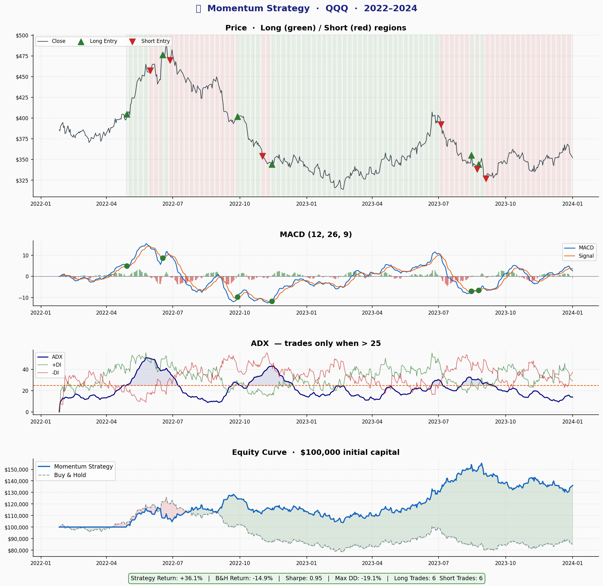
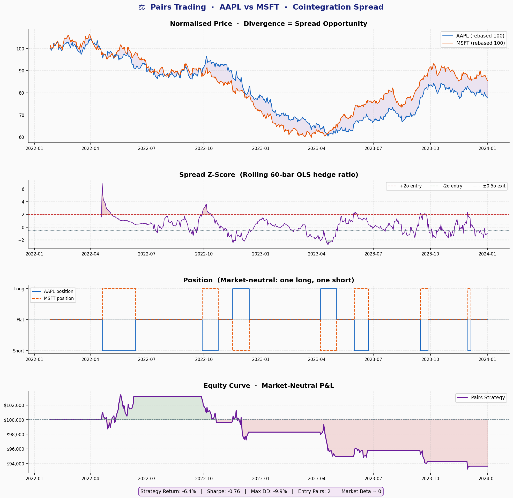

# 📈 algo-trading-consultant

> **A production-ready Python framework for building, backtesting, and deploying algorithmic trading bots.**  
> Built for freelance quant consultants to demo to clients and customise for Upwork/Fiverr gigs.

⚠️ **Disclaimer**: This repository is for **educational purposes only**. Nothing here constitutes financial advice. Trading involves substantial risk of loss. Past backtested performance does not guarantee future results.

---

## 📸 Screenshots

### Indicators Dashboard
> 8-panel real-time indicator suite — price + Bollinger Bands, RSI, MACD, ATR, ADX, Volume, OBV


---

### Mean Reversion Strategy
> RSI + Bollinger Band signal markers, %B oscillator, and equity curve vs buy-and-hold


---

### Momentum Strategy
> MACD crossover entries filtered by ADX trend strength, long/short regions, equity curve



---

### Pairs Trading
> Cointegration-based spread z-score, market-neutral position sizing, P&L



---

### Parameter Optimization
> Sharpe ratio heatmap (grid search), Bayesian TPE convergence, walk-forward fold comparison


---

### Performance Summary Dashboard
> All 3 strategies vs buy-and-hold — combined equity curves, drawdowns, key metrics


---

### Paper Trading Session
> Trade-by-trade P&L bars, cumulative P&L step chart, real-time equity simulation


---

## ✨ Features

| Feature | Details |
|---|---|
| **Custom Indicators** | RSI, MACD, Bollinger Bands, ATR, VWAP, ADX, SuperTrend, Stochastic, OBV, CMF |
| **3 Working Strategies** | Mean Reversion, Momentum (MACD+ADX), Pairs Trading (cointegration) |
| **Vectorized Backtesting** | Fast pandas/numpy engine with commission, slippage, and drawdown metrics |
| **Event-Driven Backtesting** | Backtrader integration for realistic order simulation |
| **Walk-Forward Validation** | TimeSeriesSplit to prevent lookahead bias |
| **Parameter Optimization** | Grid search, Random search, Bayesian (hyperopt TPE) |
| **Risk Management** | Fixed %, volatility-scaled, Kelly sizing; ATR stops; drawdown circuit breaker |
| **Multi-Broker Execution** | Paper (in-memory), Alpaca (stocks), CCXT (100+ crypto exchanges) |
| **PDF Reports** | Client-ready PDF backtest reports via ReportLab |
| **Config-Driven** | YAML config for easy client customisation |
| **Logging** | Loguru with rotating file logs and trade journal CSV |

---

## 🗂️ Repository Structure

```
algo-trading-consultant/
│
├── data/
│   └── fetcher.py           # yfinance, Alpaca, CCXT data fetching with caching
│
├── notebooks/
│   ├── 01_indicators_demo.ipynb   # Visual tour of all indicators
│   ├── 02_strategy_backtest.ipynb # Mean-reversion, momentum, pairs backtests
│   ├── 03_optimization.ipynb      # Grid / Bayesian parameter tuning
│   └── 04_live_bot.ipynb          # Paper trading simulation walkthrough
│
├── screenshots/                   # Preview images for README / client demos
│
├── src/
│   ├── __init__.py
│   ├── indicators.py        # Pure-function indicator library
│   ├── strategies.py        # Strategy classes + factory
│   ├── backtester.py        # Vectorized + backtrader engines, metrics
│   ├── optimizer.py         # Grid / random / Bayesian optimizer
│   ├── executor.py          # Paper / Alpaca / CCXT broker wrappers
│   ├── risk_manager.py      # Position sizing, stops, portfolio heat
│   ├── utils.py             # Logging, config, plotting, PDF reports
│   └── run_bot.py           # CLI entry point
│
├── config/
│   └── example.yaml         # Client-configurable parameters
│
├── requirements.txt
├── .gitignore
└── README.md
```

---

## 🚀 Quick Start

### 1. Clone & Install

```bash
git clone https://github.com/your-handle/algo-trading-consultant.git
cd algo-trading-consultant
pip install -r requirements.txt
```

### 2. Set API Keys (optional for live/paper trading)

```bash
# Alpaca (free paper account at alpaca.markets)
export ALPACA_API_KEY="your_key"
export ALPACA_SECRET_KEY="your_secret"

# CCXT crypto (exchange-specific)
export CCXT_API_KEY="your_key"
export CCXT_SECRET="your_secret"
```

### 3. Run a Backtest

```bash
# Mean reversion on AAPL (2020–2024)
python src/run_bot.py --strategy mean_reversion --ticker AAPL

# Momentum on QQQ with PDF report
python src/run_bot.py --strategy momentum --ticker QQQ --report

# Pairs trading (see notebooks/02 for two-ticker example)
python src/run_bot.py --strategy momentum --ticker BTC-USD --start 2021-01-01

# Use a YAML config file
python src/run_bot.py --config config/example.yaml
```

### 4. Paper Trading Loop

```bash
python src/run_bot.py --strategy mean_reversion --ticker AAPL --live --broker paper
```

### 5. Run Notebooks

```bash
jupyter lab notebooks/
```

---

## 📊 Strategies

### Mean Reversion (`mean_reversion`)

Buys when RSI is oversold **and** price is below the lower Bollinger Band; sells when RSI recovers above 50 or price crosses the middle band.


**Key parameters**: `lookback`, `rsi_period`, `rsi_oversold`, `rsi_overbought`, `bb_std`

---

### Momentum (`momentum`)

Enters long/short on MACD line crossovers, filtered by ADX trend strength (only trades when ADX > threshold to avoid choppy markets). Uses ATR for dynamic position sizing.


**Key parameters**: `fast_period`, `slow_period`, `signal_period`, `adx_threshold`

---

### Pairs Trading (`pairs_trading`)

Cointegration-based statistical arbitrage. Estimates the rolling hedge ratio (OLS regression) and trades the spread z-score: long the lagging asset when spread is stretched, exit when it mean-reverts.


**Key parameters**: `entry_z`, `exit_z`, `lookback`, `min_half_life`, `max_half_life`

---

## ⚙️ Configuration

Edit `config/example.yaml` to customise everything without touching code:

```yaml
data:
  tickers: ["AAPL", "MSFT"]
  start_date: "2020-01-01"

strategy:
  name: "mean_reversion"
  params:
    lookback: 20
    rsi_oversold: 30

risk:
  max_position_pct: 0.10
  stop_loss_pct: 0.02
  max_drawdown_pct: 0.15
  sizing_method: "kelly"

execution:
  broker: "alpaca"
  paper_trading: true
```

---

## 📐 Indicator Reference


| Function | Signature | Returns |
|---|---|---|
| `sma` | `(series, period=20)` | Series |
| `ema` | `(series, period=20)` | Series |
| `rsi` | `(series, period=14)` | Series [0–100] |
| `macd` | `(series, fast=12, slow=26, signal=9)` | DataFrame [MACD, Signal, Histogram] |
| `bollinger_bands` | `(series, period=20, std_dev=2.0)` | DataFrame [Middle, Upper, Lower, %B, Width] |
| `atr` | `(high, low, close, period=14)` | Series |
| `vwap` | `(high, low, close, volume, period=None)` | Series |
| `adx` | `(high, low, close, period=14)` | DataFrame [ADX, +DI, -DI] |
| `supertrend` | `(high, low, close, period=10, mult=3.0)` | DataFrame [SuperTrend, Direction] |
| `stochastic` | `(high, low, close, k=14, d=3)` | DataFrame [%K, %D] |
| `obv` | `(close, volume)` | Series |
| `zscore` | `(series, period=20)` | Series |
| `spread_zscore` | `(series_a, series_b, period=60)` | Series |

---

## 🛡️ Risk Management

```python
from src.risk_manager import fixed_pct_size, kelly_size, compute_stops

# Size a position (2% of $100k at $180/share)
qty = fixed_pct_size(capital=100_000, price=180, risk_pct=0.02)  # → 11 shares

# Compute stop and target prices
stops = compute_stops(entry_price=180, direction=1,  # long
                      stop_loss_pct=0.02, take_profit_pct=0.04)
# stops.stop_loss = 176.40,  stops.take_profit = 187.20
```

---

## 📈 Backtesting

```python
from data.fetcher import fetch_yfinance
from src.strategies import MeanReversionStrategy
from src.backtester import VectorizedBacktester

df = fetch_yfinance('AAPL', start='2018-01-01', end='2024-01-01')
strategy = MeanReversionStrategy(lookback=20)
signals = strategy.generate_signals(df)

bt = VectorizedBacktester(initial_capital=100_000, commission=0.001)
metrics = bt.run(signals)
print(metrics.summary())
# =============================================
#   BACKTEST PERFORMANCE SUMMARY
# =============================================
#   Total Return       :      42.31%
#   Annual Return      :       6.12%
#   Sharpe Ratio       :        1.14
#   Max Drawdown       :     -18.42%
# ...
```


---

## 🔧 Parameter Optimization

```python
from src.optimizer import StrategyOptimizer

opt = StrategyOptimizer(
    strategy_cls=MeanReversionStrategy,
    df=df,
    param_space={'lookback': [10, 20, 30], 'rsi_period': [10, 14, 21]},
    metric='sharpe',
    method='bayesian',   # or 'grid', 'random'
    n_trials=200,
    cv_folds=5,
)
best_params, results_df = opt.run()
```


---

## 🤖 Paper Trading


```bash
python src/run_bot.py --strategy momentum --ticker QQQ --live --broker paper
```

---

## 🤝 For Freelancers

This repo is designed to **impress clients** and serve as a **starting template** for common Upwork/Fiverr gigs:

- **"Build me a crypto trading bot"** → swap ticker to `BTC/USDT`, set `broker: ccxt`
- **"Optimize my RSI strategy"** → plug params into `StrategyOptimizer`
- **"I need pairs trading for stocks"** → `PairsTradingStrategy` is ready to go
- **"Add a trailing stop"** → `update_trailing_stop()` in `risk_manager.py`
- **"Give me a performance report"** → `generate_report()` produces a PDF

### Customisation tips

1. Add new indicators in `src/indicators.py` (follow the pure-function pattern).
2. Register new strategies in `src/strategies.py` `_REGISTRY` dict.
3. Point `config/example.yaml` at client's tickers and tweak params.
4. Switch `execution.broker` from `paper` → `alpaca` or `ccxt` to go live.

---

## 🧪 Testing (quick sanity check)

```bash
python -c "
from data.fetcher import fetch_yfinance
from src.strategies import MomentumStrategy
from src.backtester import VectorizedBacktester

df = fetch_yfinance('SPY', start='2020-01-01', end='2023-01-01')
sig = MomentumStrategy().generate_signals(df)
m = VectorizedBacktester().run(sig)
print(m.summary())
"
```

---

## 📄 License

MIT License. See `LICENSE`.

---

*Built for educational and freelance consulting purposes. Always paper-trade before going live. Trade responsibly.*
