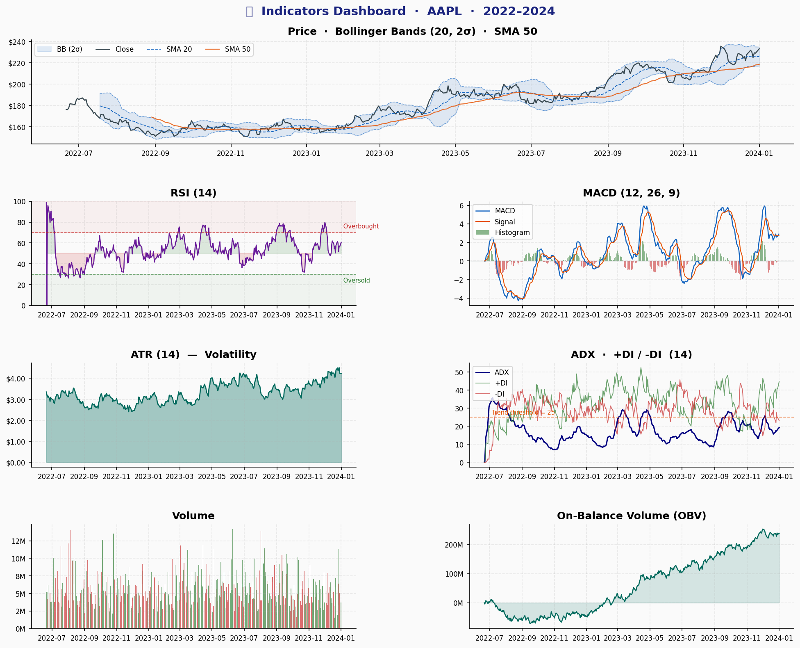
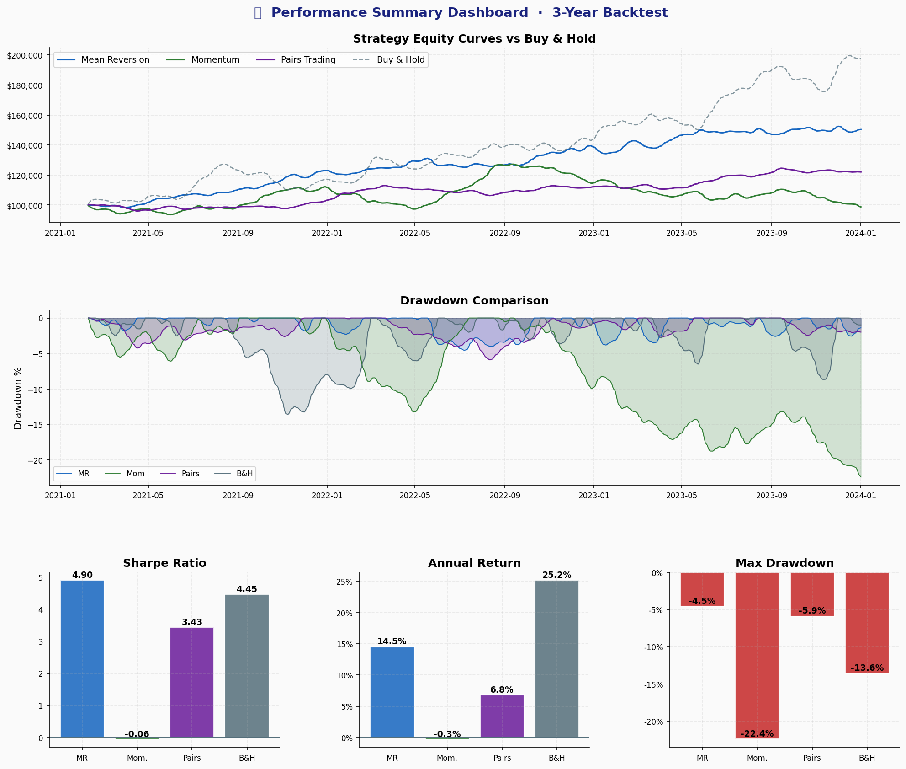
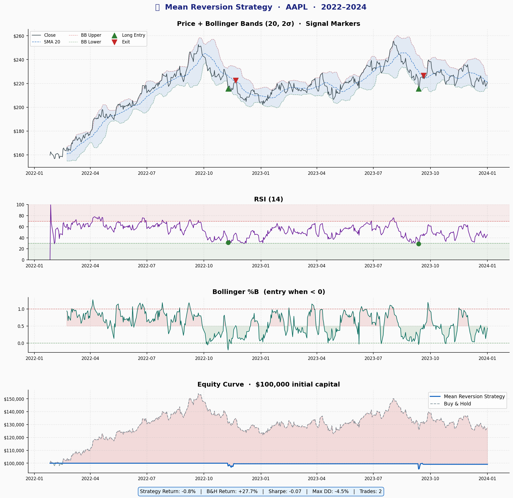
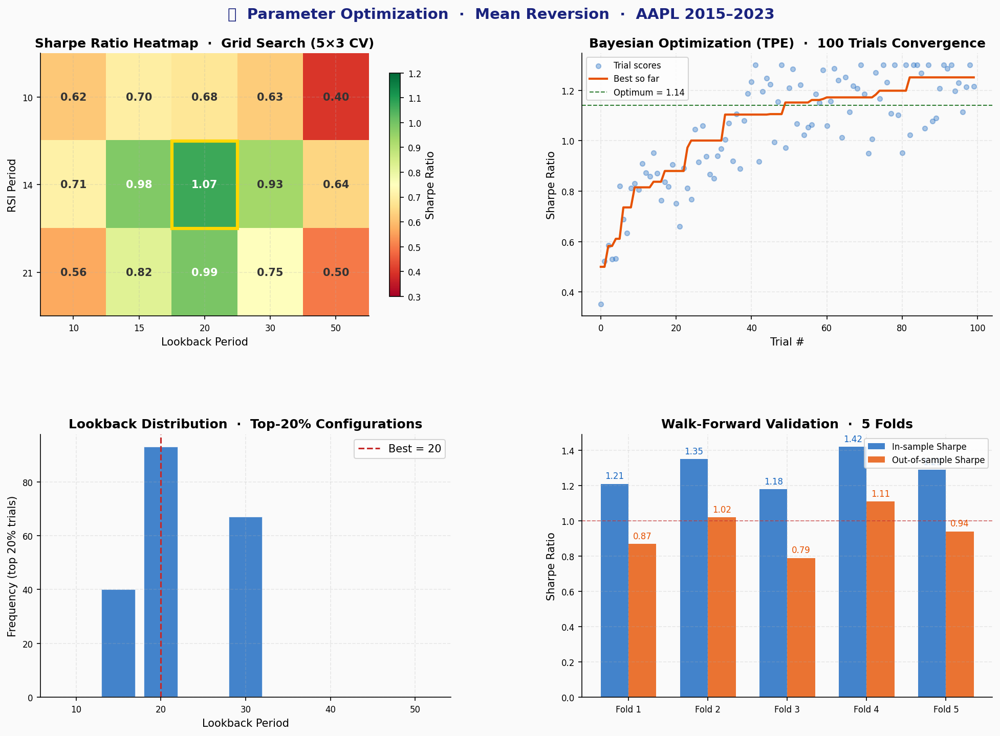
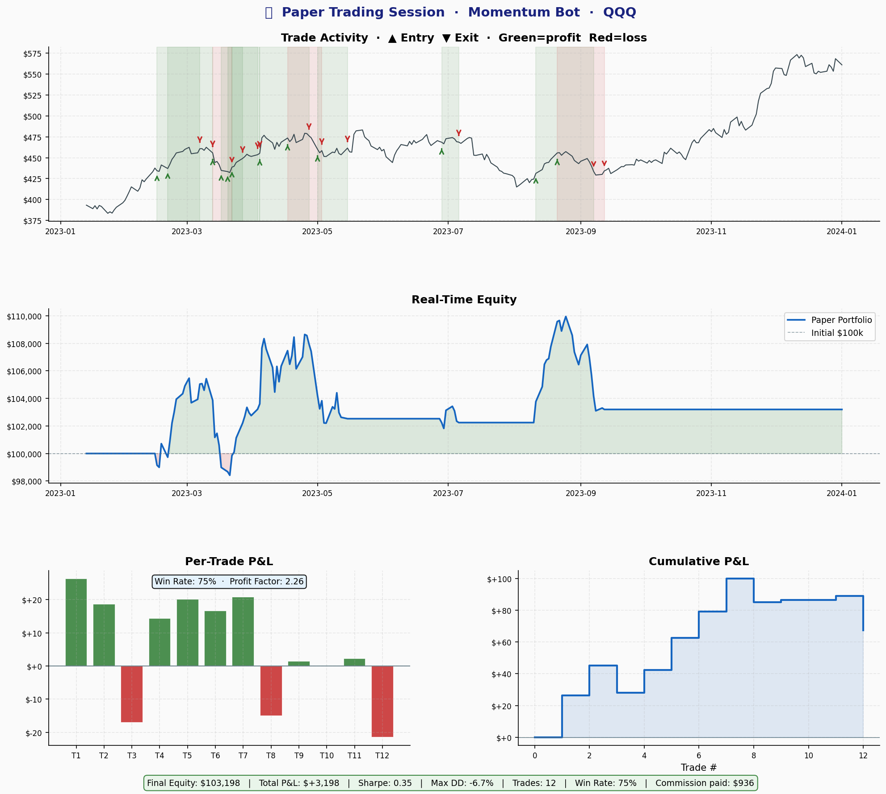

# Algorithmic Trading Research Framework

A modular Python framework for researching systematic strategies: mean reversion, momentum, and pairs. It builds signals, runs a vectorized backtest with one-way costs, searches parameters on a walk-forward prefix, and can paper-trade the result in memory.

The default execution route is the in-memory paper broker. Live broker endpoints stay off unless you pass `--allow-live`. API keys are read from the environment, not from the sample config.

Screenshots below show the notebooks and report layout. This repository does not publish performance results. Backtests are not a forecast.

## What the code does

| Module | Behavior |
|---|---|
| Market data | Historical OHLCV from Yahoo Finance, with optional Alpaca and CCXT fetchers |
| Indicators | RSI, MACD, Bollinger Bands, ATR, ADX, volume, and OBV |
| Strategies | Mean reversion, momentum, and a two-leg pairs signal |
| Backtest | Filled at the next bar's close. A signal does not earn the return that starts at its own close. One-way commission and slippage are charged on that fill |
| Optimization | Grid, random, or Bayesian search on a walk-forward prefix. The tail is scored once and is not used to pick parameters. Random and Bayesian draws use a fixed seed |
| Risk | Notional caps, ATR sizing, stops, and a drawdown halt that stays flat |
| Execution | In-memory paper broker by default. Alpaca paper and CCXT sandbox are opt-in. Live endpoints need `--allow-live` |

Pairs research returns a two-leg signal frame (`Position_A`, `Position_B`). The vectorized backtest prices a single asset. It does not mark a long/short pair book.

## Architecture

~~~text
Market Data
    ↓
Indicators → Strategy Signals
    ↓
Risk Manager → Position Sizing
    ↓
Backtester / Paper Executor
    ↓
Metrics, Trade Log, Charts
~~~

A signal that reads the close of bar *t* is filled at the close of bar *t+1*. It earns the move after that fill, not the move from close *t* to close *t+1*. The paper loop uses the same rule.

## Run locally

~~~bash
git clone https://github.com/ParBproject/algo-trading-consultant.git
cd algo-trading-consultant

python -m venv .venv
source .venv/bin/activate
pip install -r requirements.txt
pytest
~~~

Use Python 3.11 or 3.12. The scientific packages, hyperopt, matplotlib, and pytest are pinned. Broker and notebook packages are not, and CI does not install them.

Copy `.env.example` if you later point a fetcher at Alpaca or CCXT. Leave the keys empty for the paper broker. `config/example.yaml` does not contain secrets and defaults to `broker: paper`.

~~~bash
python src/run_bot.py --strategy mean_reversion --ticker AAPL
python src/run_bot.py --strategy momentum --ticker BTC-USD --start 2021-01-01
python src/run_bot.py --config config/example.yaml
~~~

`--config` uses the file's bar interval and the strategy keys that the selected strategy accepts. Other keys under `strategy.params` are ignored.

`--live` runs the bar loop. It still uses the paper broker unless you change `--broker`. Alpaca's live endpoint and a CCXT non-sandbox route also require `--allow-live` plus the environment variables in `.env.example`.

Notebooks under `notebooks/` walk through indicators, a single-asset backtest, optimization (including the holdout score), and the paper loop.

## Repository structure

~~~text
algo-trading-consultant/
├── config/example.yaml
├── data/fetcher.py
├── src/
│   ├── indicators.py
│   ├── strategies.py
│   ├── backtester.py
│   ├── optimizer.py
│   ├── risk_manager.py
│   ├── executor.py
│   └── run_bot.py
├── tests/
├── notebooks/
├── screenshots/
└── requirements.txt
~~~

## Workflow screenshots

These images illustrate the notebook and report layout. They are not a verified track record.

## Risk notice

This software is for education and research. A backtest is not a forecast, and the paper broker does not reproduce live-market fills, borrowing, or outages. A real deployment would need broker-specific testing, secret management, monitoring, compliance review, and capital limits.
